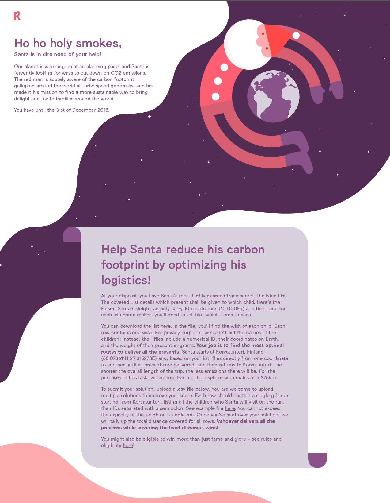
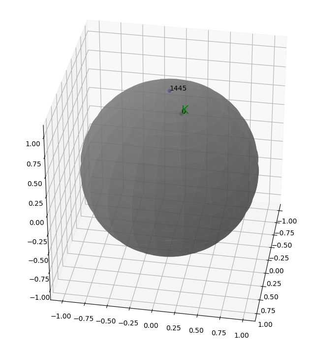
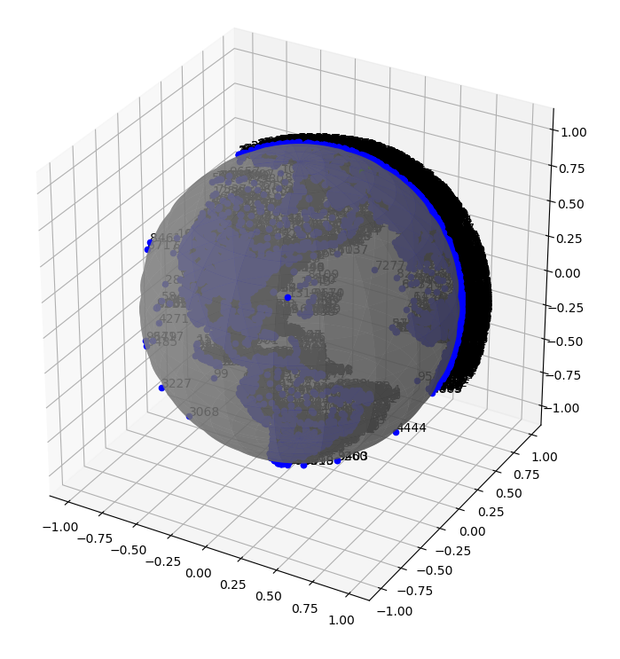

# Traveling Santa 2018
Contest by [Reaktor](http://www.reaktor.com) in December 2018: [Traveling Santa](https://traveling-santa.reaktor.com).
Input file [the Nice List](./nicelist.txt) provided.
#
 
#
**Problem Type:** [Capacitated Vehicle Routing Problem ](https://developers.google.com/optimization/routing/cvrp), [Vehicle routing problem](https://en.wikipedia.org/wiki/Vehicle_routing_problem).
# Results
* The winning score: 7 617 894 396 meters (7.62 million km)
* TOP 20 threshold: 7 806 673 753 meters  (7.81 million km)
* Own score: 9708746 km (9.71 million km).   [The output file](./output.txt).
###
Source: Python 3.x.
About [the implementation](./santa_solve.py): more or less ad hoc code, not recognizing the exact TSP, manual geographical clustering, single threaded,  5-nearest neighbors for nodes. Takes hours to complete a result. Solver's code hard to maintain, not easy to comprehend after many months.
### Displaying nodes with Visualize()
Gives some insight to the problem when one can view the children's global locations. For example, the North Pole and Korvatunturi look like this:
####

###
Displaying all 10000 locations is possible but it takes a lot of time. The Americas are visible:
###

