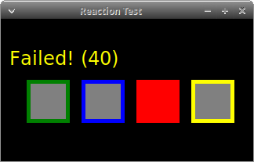

# Reaction Test (2019)
Experimenting Tkinter/Canvas. Based loosely on [Protacon's](http://www.protacon.com)  LabView [programming challenge.](http://www.protacon.com/labview-tehtava)  
Update: since 2020 Protacon is Pinja. 
* [the original assignment here - a screenshot.](./protacon.png)
## Usage
Keys *A, S, D, F*  or the left mouse button. *Q* to exit.
##

